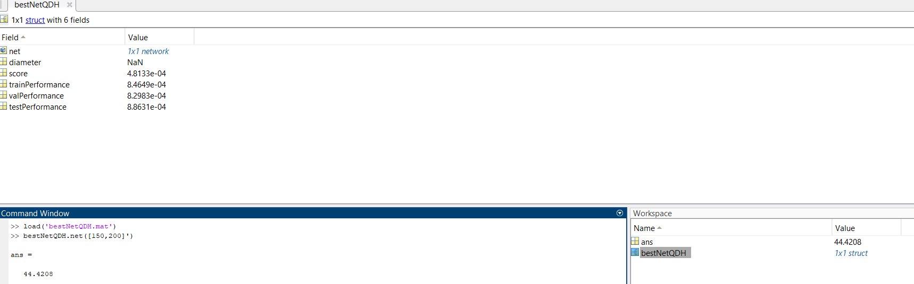
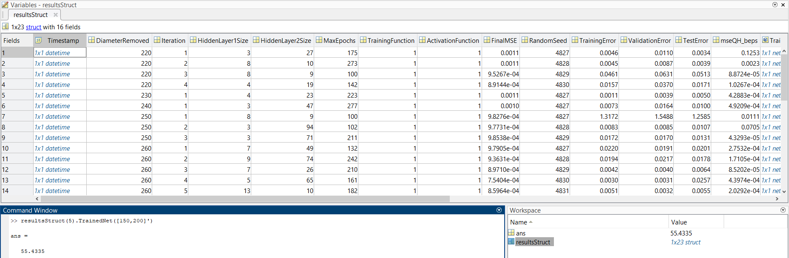

# prediction of the effect of impeller trimming on centrifugal pump performance using AI.

## Introduction

This project aims to optimize and validate the performance of neural networks in predicting the characteristics of pump impeller trimming. The primary focus is on leveraging data-driven approaches to predict key metrics like flow rate, head, and power for different pump diameters. The project consists of several MATLAB scripts and data files, which together facilitate the preparation, training, and optimization of neural networks for this purpose.


## Files and Folders Structure Philosophy

a general philosophy is that each script saves its output in a folder on same name as the script name
and for each script all the needed functions are defined within it at the end.

*all training data* are in *training-data* folder where you will find our main dataset which is :

- **filtered_QHD_table.mat** : this contains (Q Head) inputs to the nn Diameter (output from nn) with points corresponding to best efficiency points deleted for testing the net performance after training.
- **filtered_QDP_table.mat** : this contains (Q Diameter) inputs to the nn Power (output from nn) with points corresponding to best efficiency points deleted for testing the net performance after training.

those have table structure but for the deleted best efficiency points.

- **deleted_QHD_table.mat** 
- **deleted_QDP_table.mat**


the project is consisting mainly of the following files :

### `optimize_nn_hyperparameters_routine.m` 

The `optimize_nn_hyperparameters_routine.m` script automates the process of tuning neural network hyperparameters for optimizing pump performance prediction. By leveraging a genetic algorithm, it efficiently searches for the best configuration, ensuring robust and accurate predictive models.

#### File Description: `optimize_nn_hyperparameters_routine.m`
This MATLAB script is designed to optimize the hyperparameters of a neural network using a genetic algorithm (GA). It performs the following tasks:

1. **Load Data**: The script loads the training and validation data from four `.mat` files: `filtered_QHD_table.mat`, `filtered_QDP_table.mat`, `deleted_QHD_table.mat`, and `deleted_QDP_table.mat`.

2. **Prepare Data**: The data is prepared for training by extracting relevant features and targets:
   - `QH` (Flow rate and Head)
   - `D` (Diameter)
   - `QD` (Flow rate and Diameter)
   - `P` (Power)

3. **Set Hyperparameters**:
   - Number of hidden layers: 5
   - Neuron bounds: Specifies the lower and upper bounds for the number of neurons in each hidden layer.

4. **Genetic Algorithm Options**: The script sets the options for the GA, including the fitness limit.

5. **Call Optimization Routine**: The main function `optimize_nn_hyperparameters` is called to perform the optimization, which returns the best network and its parameters.

6. **Display Results**: The best hyperparameters and training performance are displayed.

#### Key Functions

- **`optimize_nn_hyperparameters`**: This function performs the actual optimization of the neural network hyperparameters.
  - **Inputs**:
    - `input_data`: Input features for training.
    - `output_data`: Target values for training.
    - `num_hidden_layers`: Number of hidden layers in the neural network.
    - `neuron_bounds`: Bounds for the number of neurons in each hidden layer.
    - `ga_opts`: Options for the genetic algorithm.
    - `userSeed`: Seed for random number generation to ensure reproducibility.
  - **Outputs**:
    - `best_net_global`: The best neural network model found.
    - `best_params`: Best hyperparameters (number of neurons in each hidden layer).
    - `nnPerfVect`: Performance vector (training, validation, and test errors).

- **`plot_nn_vs_real_data`**: This function plots the actual vs. predicted output of the neural network for visualization.

- **`nn_fitness`**: This function defines the fitness function for the GA, which trains the neural network and calculates the mean squared error (MSE).

- **`log_nn_details`**: This function logs the details of the neural network training process, including the hyperparameters and performance metrics.

#### Usage

To run the script, ensure the following data files are available in the `./training-data/` directory:
- `filtered_QHD_table.mat`
- `filtered_QDP_table.mat`
- `deleted_QHD_table.mat`
- `deleted_QDP_table.mat`

Execute the script in MATLAB:
```matlab
optimize_nn_hyperparameters_routine
```

The script will load the data, set up the neural network, perform hyperparameter optimization using the genetic algorithm, and display the best parameters and performance metrics its meant to be used more generally than the others it represents the core functionality and all of the other could be considered as variants of the logic used here.


### `final_results_plots_tables_comparisons.m`


The script `final_results_plots_tables_comparisons.m` is designed to train and evaluate neural networks on various datasets representing hydraulic and power characteristics. The goal is to identify the best-performing neural networks by removing specific diameters from the dataset and analyzing the performance. The script generates plots, logs, and saves results and the best neural networks.

you will find all of the output of our running to it in folder **final_results_plots_tables_comparisons**


## File Structure

```
final_results_plots_tables_comparisons.m
training-data/
    filtered_QHD_table.mat
    filtered_QDP_table.mat
    deleted_QHD_table.mat
    deleted_QDP_table.mat
final_results_plots_tables_comparisons/
    figures/
    QHD_results.csv
    QDP_results.csv
    QDH_results.csv
    logs.txt
    bestNetQHD.mat
    bestNetQDP.mat
    bestNetQDH.mat
```

## Data Files

- **filtered_QHD_table.mat**: Filtered QHD data containing `FlowRate_m3h`, `Head_m`, and `Diameter_mm`.
- **filtered_QDP_table.mat**: Filtered QDP data containing `FlowRate_m3h`, `Diameter_mm`, and `Power_kW`.
- **deleted_QHD_table.mat**: Deleted QHD data points representing best efficiency points (BEPs).
- **deleted_QDP_table.mat**: Deleted QDP data points representing best efficiency points (BEPs).

## Script Functionality

### 1. Initialization

The script initializes by clearing the workspace and loading the data files. The datasets are extracted into variables for further processing.

### 2. Create Output Directories

Output directories `final_results_plots_tables_comparisons` and `figures` are created if they do not exist.

### 3. Hyperparameters

Hyperparameters for the neural networks are defined, including network size matrices, maximum epochs, training function, and random seed.

### 4. Initialize Results Tables

Results tables `QHD_results`, `QDP_results`, and `QDH_results` are initialized with appropriate headers.

### 5. Weights for Error Calculation

Weights for different errors are defined to compute the weighted score for the neural networks.

### 6. Best Neural Networks Initialization

Structures for storing the best neural networks for QHD, QDP, and QDH are initialized.

### 7. Train on Full Dataset

Neural networks are trained on the full dataset without removing any diameters, and performance metrics are calculated and stored.

### 8. Plot and Save Results

Test data vs trained network predictions are plotted and saved as images in the `figures` directory.

### 9. Train on Different Diameters

A loop iterates through each distinct diameter in the dataset, training neural networks with one diameter removed at a time. Performance metrics are calculated, and results are stored. The best neural network for each type is updated if a better one is found.

### 10. Save Results and Logs

The results tables and logs are saved to CSV files and a text file, respectively. The best neural networks are saved as `.mat` files.

### 11. Display Results

The results and best neural networks are displayed in the MATLAB console.

## How to Use

1. **Prepare Data**: Ensure the required data files (`filtered_QHD_table.mat`, `filtered_QDP_table.mat`, `deleted_QHD_table.mat`, `deleted_QDP_table.mat`) are in the `training-data` directory.
2. **Run the Script**: Execute the script in MATLAB. The script will automatically create output directories, train neural networks, and save results.
3. **View Results**: Check the `final_results_plots_tables_comparisons` directory for the generated plots, results tables, logs, and the best neural networks.

## Functions

### train_nn

```matlab
[trainedNet, avgMSEs, trainPerformance, valPerformance, testPerformance] = train_nn(size_matrix, maxEpochs, trainFcn, input, target, seed)
```

Trains a neural network with the specified parameters and returns the trained network and performance metrics.

### compute_score

```matlab
score = compute_score(trainPerformance, valPerformance, testPerformance, mse_deleted_diameter, mse_beps, weights)
```

Computes the weighted score for the neural network based on the provided performance metrics and weights.

## Plots

- **QHD_Diameter_NaN.png**: Plot of QHD data without any diameter removed.
- **QDH_Diameter_NaN.png**: Plot of QDH data without any diameter removed.
- **QDP_Diameter_NaN.png**: Plot of QDP data without any diameter removed.
- **QHD_Diameter_<removed>.png**: Plot of QHD data with specific diameter removed.
- **QDH_Diameter_<removed>.png**: Plot of QDH data with specific diameter removed.
- **QDP_Diameter_<removed>.png**: Plot of QDP data with specific diameter removed.

## Logs

- **logs.txt**: Contains logs of the training process, including successful training messages and error messages.

## Results

- **QHD_results.csv**: Results of the QHD neural network training.
- **QDP_results.csv**: Results of the QDP neural network training.
- **QDH_results.csv**: Results of the QDH neural network training.
- **bestNetQHD.mat**: Best QHD neural network.
- **bestNetQDP.mat**: Best QDP neural network.
- **bestNetQDH.mat**: Best QDH neural network.

** here is example on how to use the saved structs for example `bestNetQHD.mat` **





##  `optimize_nn_hyperparameters_nested_loops.m`

The `optimize_nn_hyperparameters_nested_loops.m` script is designed to optimize the hyperparameters of a neural network for predicting pump impeller trimming characteristics. This script uses nested loops to iterate over different diameters removed from the training data and optimizes the neural network for each diameter.

the main philosophy here is to explore the neural networks in a more details and rely not only on statistical measures but on the topology of the data and plots of nn vs reals data for different whole  Q,H curves removed from the training data and compare it for all of the 5 curves corresponds to 5 diameters. here in `optimize_nn_hyperparameters_nested_loops.m` it focus on the QDH dataset. while `optimize_nn_hyperparameters_nested_loops_02.m` has the exact same structure but works for the QDP dataset.

### Main Functionality
1. **Load Data**:
   - Loads training and testing data from specified `.mat` files.

2. **Preprocessing**:
   - Constructs matrices `QH`, `D`, `QH_beps`, `D_beps`, `QD`, `P`, `QD_beps`, and `P_beps` from the loaded data.

3. **Hyperparameter Optimization**:
   - Uses nested loops to remove each distinct diameter from the training data.
   - For each removed diameter, optimizes the hyperparameters of a neural network through multiple iterations.
   - Tracks and saves the performance metrics and the optimized neural network.

4. **Performance Evaluation**:
   - Computes Mean Squared Error (MSE) for the removed diameter and another test set (`QH_beps`).
   - Uses a combination of MSE metrics to adjust hyperparameter bounds and guide optimization.

5. **Visualization and Saving**:
   - Generates and saves plots for the predictions of the neural network.
   - Saves the results, including the optimized hyperparameters and performance metrics, to a CSV file and a `.mat` file.

### Key Variables
- **Data Variables**:
  - `QH`, `D`: Training data for flow rate and head, and diameters.
  - `QH_beps`, `D_beps`: Test data for flow rate and head, and diameters.
  - `QD`, `P`: Additional training data for flow rate, diameters, and power.
  - `QD_beps`, `P_beps`: Additional test data for flow rate, diameters, and power.

- **Optimization Parameters**:
  - `userSeed`: Random seed for reproducibility.
  - `mseThreshold`: Threshold for MSE to exit the loop early.
  - `distinctDiameters`: Unique diameters in the training data.
  - `weightDiameter`, `weightBeps`: Weights for combining MSE metrics.

- **Files**:
  - `resultsFilename`: CSV file to store results.
  - `structFilename`: MAT file to store results in a structured format.

### Execution Flow
1. **Initialization**:
   - Clears the workspace and loads data.
   - Initializes bounds for hyperparameters and sets up result storage.

2. **Main Loop**:
   - Iterates over each distinct diameter, removes it from the training data, and optimizes the neural network.
   - In each iteration, performs the following steps:
     - Removes the current diameter from the training data.
     - Optimizes the neural network using `optimizeNNForTrimmingPumpImpeller`.
     - Computes MSE for the removed diameter and the `QH_beps` test set.
     - Saves the performance metrics and the trained network.
     - Generates and saves plots for the neural network predictions.
     - Adjusts hyperparameter bounds based on MSE improvement.
     - Exits the loop early if MSE is below the threshold.

3. **Finalization**:
   - Saves all results to the specified CSV and MAT files.
   - Displays a message indicating the completion of the optimization process.

### Results
- The results are saved in:
  - `results_loop.csv`: Contains hyperparameter values, performance metrics, and random seeds for each iteration. we omitted this part from `optimize_nn_hyperparameters_nested_loops_02.m` since all of this is also found in the struct.
  - `result_struct.mat`: Structured format of the results, including the trained neural networks and plots file path.
you can use any of the saved nets by loading the struct and then access the net as follows :

assuming you are in the same folder

*execute:*

- load('`result_struct.mat`')
- resultsStruct(5).TrainedNet([150,200]')  this is [Q,H]'.
   - ans:   55.4335




### Usage
To run the script, ensure that the required data files are in the `training-data` directory. Execute the script in MATLAB, and it will automatically perform the optimization and save the results.

```matlab
optimize_nn_hyperparameters_nested_loops
```

---


